# vertical-align

## 引入vertical-align属性

在前端领域居中问题是非常经典的问题，最多的是水平方面的居中。我们可以使用例如：
* margin: 0 auto;
* text-align: center;
* transition: translateX(-50%);left: 50%;position: absolute;
* .....

以上针对不同的情况，可以使用相应的解决方案。

而当我们说到垂直方向的居中的时候，可能会第一个想到的是CSS直接提供的属性vertical-align。

## vertical-align简介

首先说明一点是，**vertical-align的作用其实是控制元素的垂直对齐方式**，而不是绝对的解决垂直居中的方案。因为有时候当你使用它的时候，你会发现，nothing happened。而神奇的是，它附近的元素改变了。

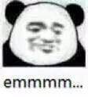

## 应用对象

vertical-align的作用对象是`inline-level element`，也就是内联级元素。内联级元素指的是其CSS属性`display`的属性值为：

* `inline`
* `inline-block`
* `inline-table`（这里暂不讨论）

的元素，它们会生成`inline-level boxs`。

*在MDN中，也有提到vertical-align的作用对象也可以作用于伪元素`::first-letter`和`::first-line`。*

## 预备知识

### Baseline(基线)

在各种内联相关模型中，凡是涉及到垂直方向的排版或者对齐的，都离不开最基本的基线。例如，本篇文章讲的`vertical-align`。那到底什么是基线呢？要想知道什么是基线，就必须先说一下和CSS有很大关系的一个字母：`x`，注意是小写的字母。

字母`x`与CSS有很大的渊源。CSS中有一个概念叫做`x-height`，通俗讲，`x-height`就是指的小写字母`x`的高度；术语描述就是基线和等分线[mean line](也称作中线[midline])之间的距离。

维基上有一个示意图，如下：

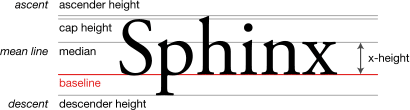

从图中就可以看到`x-height`的示意范围，并且其中我们能看到在字母`x`的下边缘有一条线叫做`baseline`，这其实就是基线的定义：

**字母x的下边缘(线)就是我们的基线。**

>上面图中还出现了其他的名词，这里简单说下我的理解（引用张鑫旭的文章）：
>
>ascender height: 上下线高度
>cap height: 大写字母高度
>median: 中线
>descender height: 下行线高度

这里讲解`x-height`的目的不仅是为了引出基线的定义，CSS中有些属性值的定义就和这个"x-height"的有关，例如：`vertical-algin: middle`。这个在稍后会讲解原因的。


而在w3c中对vertical-align的描述中有说到：

> This property affects the vertical positioning inside a line box of the boxes generated by an inline-level element.

这句话告诉了我们`vertical-align`作用的对象是由 `inline-level` 元素生成的盒子在`line boxs`中垂直方向的对齐方式。

这里有两点是我没有见过或者具体了解过的，一个是`inline-level element`，另一个是`line boxs`。它们可以被翻译为内联元素和行盒子。

那到底什么是内联级元素，什么是`line boxs`，接下来我们来解答这个问题。并且在深入了解vertical-align之前，我们也需要了解一些预备的知识。

### inline-level element

首先说一下什么样的元素可以被称为inline-level element（内联级元素）。内联级元素们的`display`属性一般为：
 
* inline：一般情况下，行内元素只能包含数据和其他行内元素，例如：span，img，a。
* inline-block：是一个块级元素，表现形式却是一个内联元素。它们可以有宽度和高度以及内填充,边框和外边距。
* inline-table（暂不讨论）

### line boxs

在CSS中有一个叫做`visual formatting model`的概念，我们可以把叫做视觉格式化模型。*它是用来处理文档并将它显示在视觉媒体上的机制。它的一部分工作就是`Box generation`，也就是通过文档元素来生成盒子。*

生成的盒子具有不同的类型，其类型取决于CSS属性`display`。**当元素的CSS属性`display`的计算值为`inline`，`inline-block`，`inline-table`时，称这类元素为`inline level element`。**

`inline-level element`生成`inline-level boxes`,


## vertical-align原理及属性值详解

上文我们说到`vertical-align`与`Baseline`有很大的关系，到底有多大呢？我们来看一下[w3c](https://www.w3.org/TR/CSS21/visudet.html#propdef-vertical-align)对`vertical-align`描述的相关信息：

```
'vertical-align'
Value:  	baseline | sub | super | top | text-top | middle | bottom | text-bottom | <percentage> | <length> | inherit
Initial:  	baseline
Applies to:  	inline-level and 'table-cell' elements
Inherited:  	no
Percentages:  	refer to the 'line-height' of the element itself
Media:  	visual
Computed value:  	for <percentage> and <length> the absolute length, otherwise as specified
This property affects the vertical positioning inside a line box of the boxes generated by an inline-level element.
```

其中与`baseline`有关的属性值为：

* baseline
* middle
* sub
* super
* `<percentage>`
* `<length>`

在讲解这些属性值之前，首先我们要确定baseline的位置。

### 基线位置的确定

`vertical-align`的作用对象是`inline-level element`（内联级元素），不同的display属性值对应的基线的位置也是不同的。`display`属性值为：

* `inline`，内联元素的baseline是里面文本字母`x`的下边缘线。（即使没有字母x，也可以想象文中有一个字母x存在）
* `inline-block`，内联块元素的baseline位置的确定规则分为三种情况
    * `inline-block`元素盒子里没有内容，是一个空的盒子时，baseline的位置为该盒子`margin-bottom`的边界（如果margin-bottom为0，那就是盒子的下边界）。如下图背景为蓝色的div。
    * `inline-block`元素盒子里有内容，并且其`overflow`属性值为`visible`（默认值）时，那么该盒子的baseline的位置就是内部内容的最后一个内容元素的baseline的位置。如下图背景为白色的div。
    * `inline-block`元素盒子里有内容，但是其`overflow`属性值为非`visible`（比如`overflow: hidden`），那么该盒子的baseline位置就是该盒子`margin-bottom`的边界。如下图背景为黄色的div。

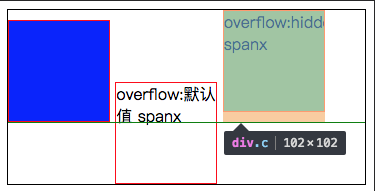

通过上面我们知道了在父元素下不同`display`属性值的盒子基线位置的确定，但是我们还不知道父元素的baseline是如何确认的？

>父元素里最后一个没有设置任何对齐方式的inline-level box（内联级盒子元素）的baseline就是父元素的基线。

由于`line box`是不可见的，无法直观的确定，如果所有子元素都设置了`vertical-align`属性，可以通过在父元素内容最后加一个字符`x`来确定父元素的baseline。例如为`line box`添加其伪元素，其`content`的属性值为`x`，那么`line box`的基线就可以看到了——就是字母x的下边缘线。

**所以说`line box`的基线就是存在`line box`里一个看不到的字母`x`的基线。**而且因为这个看不到的`x`，还会有很多神奇的表现。在接下来对`vertical-align`属性值讲解的过程中会提到这些现象。

### baseline的计算方法


### vertical-align基于baseline的不同取值

#### 1. baseline

将子元素盒子的baseline与父盒子的baseline对齐。

看个栗子：
css:

``` css
.line-box {
    position: relative;
    padding-left: 100px;
    border: 1px solid black;
}
.child-box1, .child-box2 {
    display: inline-block;
    width: 100px;
    height: 100px;
    border: 1px solid red;
}
.line {
    position: absolute;
    top: 100px;
    height: 1px;
    width: 300px;
    background: black;
}
```

html: 

``` html
<div class="line-box">
    <!-- 横线，测试用，用来比对两个子元素和父元素对齐的位置 -->
    <div class="line"></div>
    <div class="child-box1"></div>
    <div class="child-box2"></div>
</div>
```
[具体代码和效果](http://en.jsrun.net/bviKp)

效果图：

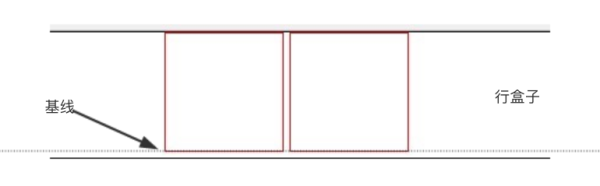

两个为空的`inline-block`元素，它们的基线为盒子的底部边界，那么按照我们的预想应该是这样的：

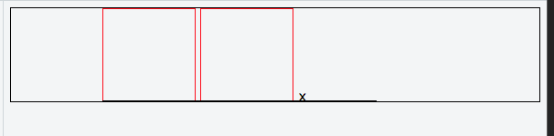

然而并非如此。在红色边框盒子与行盒子之间会有条缝隙，这是为什么呢？其实我们可以动手添加一个字母`x`来直观的确定下行盒子的baseline位置。

[具体代码和效果](http://en.jsrun.net/fviKp)

效果图：

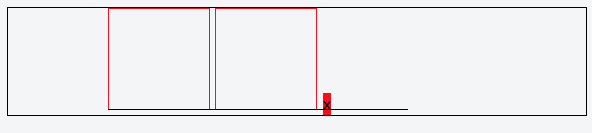

真相就是其实它们是基线对齐了，但是由于**字母'x’所占据的空间，在baseline的下方还会有一部分**，字母`x`的整个大小范围看见红色背景所示，所以才会出现这条缝隙。

那么如何去掉缝隙呢？出现缝隙的原因本质其实是字母`x`的高度，而字母`x`高度由`font-size`和`line-height`决定，所以其实只要把`font-size`或者`line-height`设置为0px即可。除此之外，我们也可以让子元素使用其他的对齐方式来避免由字母`x`所占空间带来的影响。

#### 2. middle

>w3c: Align the vertical midpoint of the box with the baseline of the parent box plus half the x-height of the parent.

让子元素盒子垂直中点与行盒子的baseline+字母‘x'高度的一半对齐。

这也就是我们上文所说到的`x-height`的其他用处，规范中对垂直对齐的`middle`这么解释的：

>middle: This identifies a baseline that is offset from the alphabetic baseline in the shift-direction by 1/2 the value of the x-height font characteristic. The position of this baseline may be obtained from the font data or, for fonts that have a font characteristic for “x-height”, it may be computed using 1/2 the “x-height”. Lacking either of these pieces of information, the position of this baseline may be approximated by the “central” baseline.

大致意思就是：middle指的是基线往上1/2 "x-height"高度。我们可以近似脑补成字母x交叉点那个位置。

由此可见，**`vertical-align: middle`并不是绝对的垂直居中对齐，**我们平常看到的middle效果只是一种近似的效果。原因很简单，因为不同的字体，其在行内盒子中的位置是不一样的，比方说’微软雅黑’就是一个字符下沉比较明显的字体，所有字符的位置相比其他字体要偏下一点。要是`vertical-align: middle`是相对容器中分线对齐，你会发现图标和文字不在一条线上，而相对于字符x的中心位置对齐，我们肉眼看上去就好像和文字居中对齐了。（这就是为什么开头说`vertical-align`不是解决垂直居中的绝对解决方案）

css:

``` css
.child-box1, .child-box2 {
   vertical-align: middle;
}
.line {
   top: 50px;
}
```

[具体代码和效果](http://en.jsrun.net/2viKp)

效果图

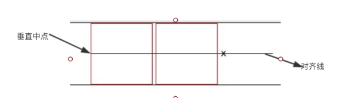

#### 3. text-top

> w3c: Align the top of the box with the top of the parent's content area


子元素盒子的顶部和行盒子里内容区域的顶部对齐

[具体代码和效果](http://en.jsrun.net/6viKp)

css

``` css
.child-box1, .child-box2 {
    vertical-align: text-top;
}
.line {
    top: 0px;
}
```

效果图

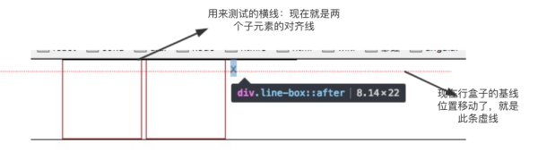

#### 4. text-bottom

> w3c:Align the bottom of the box with the bottom of the parent's content area

子元素盒子的底部和行盒子里内容区域的底部对齐

[具体代码和效果](http://en.jsrun.net/wviKp)

``` css
.child-box1, .child-box2 {
   vertical-align: text-bottom
}
.line {
   top: 101px; // 子元素盒子的底部包包括1像素的底部边框
}
```

效果图：

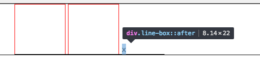

#### 5. sub

> w3c:Lower the baseline of the box to the proper position for subscripts of the parent's box. (This value has no effect on the font size of the element's text.) 

降低子元素盒子的基线到父元素盒子下标的位置。那么到底下标的位置在哪里呢？来看下面的栗子：

我们知道在html中有一个叫做`<sub>`和`<sup>`的标签，分别表示上标签和下标签。这里我们添`<sub>`标签：

[具体代码和效果](http://en.jsrun.net/aviKp)

``` css
.line {
    top: 50px;
}
.child-box1 {
   vertical-align: sub;
}
```

``` html
<div class="line-box">
    <div class="line"></div>
    <div class="child-box1">
    </div>
    <div class="child-box2">
    </div>
    <sub>sub test</sub>
</div>
```

效果图：

[效果图](./v2-1f0b0bf61563d300019e35f1c110aefc_b.png)

可以看见，设置vertical-align:sub的第一个元素盒子的基线和父元素盒子下标内容的基线对齐。第二个元素没有设置vertical-align属性（默认值baseline）基线和行盒子的基线对齐。

所以下标的位置就是`<sub>`标签包裹内容的基线的位置。

#### 6. super

> w3c :Raise the baseline of the box to the proper position for superscripts of the parent's box. (This value has no effect on the font size of the element's text.)

升高子元素盒子的基线到父元素盒子上标的位置。

类似`sub`属性值，我们可以向父元素盒子里直接添加一个上标`<sup>`标签，这里直接上栗子：

效果图：

[效果图](./v2-733c8f1f9ac403403aee73c8a004a530_b.png)

#### 7. `<percentage>`

> w3c : Raise (positive value) or lower (negative value) the box by this distance (a percentage of the 'line-height' value). The value '0%' means the same as 'baseline'. 

百分比的值是相对该元素的line-height数值的（元素有默认行高的），具体的升高/降低数值由由该元素的line-height的值乘以百分比计算得出。相对自己baseline，升高或较低该元素一定距离。0%位置就是默认的baseline。

``` css
.child-box1 {
   line-height: 100px;
   vertical-align: 10%;
}
.line {
  // 子元素盒子高度100px + 2px上下两边框 + 相对自己baseline位置向上移动10px
  top: 112px;
}
```

为了明显看出效果，设置第一个元素盒子的`line-height：100px;`（不使用默认值），设置第一个元素盒子的`vertical-align: 10%;` 因此该元素相对baseline移动(向上)的距离为*100px * 10% = 10px*。

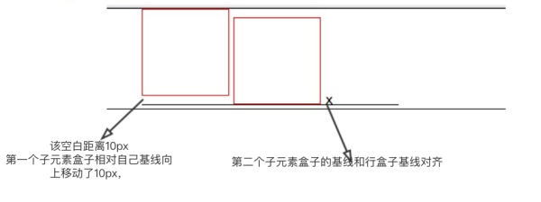

#### 8. `<length>`

该值为一定的像素数值，与vertical-align:percentage效果类似，除了移动的距离是被计算出来的。

### vertical-align基于line box的不同取值

#### 1. top

> w3c: Align the top of the aligned subtree with the top of the line box.

将子元素盒子的顶部和其所在的line box顶部对齐。我们通过两个例子对比一下。

首先是第一个元素未设置`vertical-align: top`:

``` css
.child-box1 {
    margin-top: 20px;
}
```

设置第一个子元素盒子的margin-top为20px，效果图如下

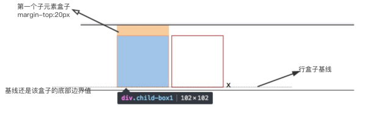

然后是第一个元素设置`vertical-align: top;`，也设置`margin-top: 20px`

效果图如下：

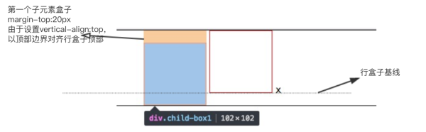

第一个子元素设置vertical-align: top，以盒子顶部和行盒子顶部对齐，所以该元素也就不是基于基线对齐了。那么第二个子元素和字母x位置就变动了(整体上移)

#### 2. bottom

>w3c:Align the bottom of the aligned subtree with the bottom of the line box.

效果图：

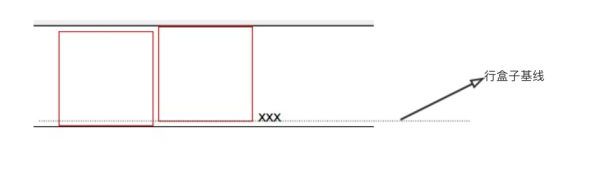

## 案例


## 参考链接

[css vertical-align你真的很了解嘛](https://zhuanlan.zhihu.com/p/28626505?utm_medium=social&utm_source=wechat_session)
[深入理解css中vertical-align属性](http://www.cnblogs.com/starof/p/4512284.html)
[MDN](https://developer.mozilla.org/en-US/docs/Web/CSS/vertical-align)
[w3c](https://www.w3.org/TR/CSS2/visudet.html#propdef-vertical-align)
[Understanding vertical-align](http://phrogz.net/css/vertical-align/index.html)
[Vertical-Align: All You Need To Know](http://christopheraue.net/2014/03/05/vertical-align/)
[字母’x’在CSS世界中的角色和故事](http://www.zhangxinxu.com/wordpress/2015/06/about-letter-x-of-css/)
[Deep dive CSS: font metrics, line-height and vertical-align](http://iamvdo.me/en/blog/css-font-metrics-line-height-and-vertical-align)
